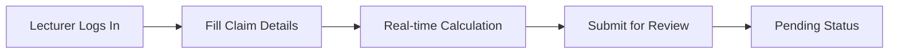
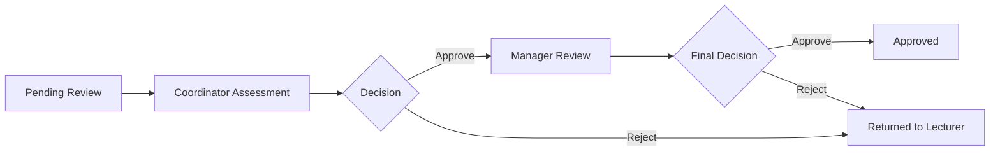

# 📋 Contract Monthly Claim System (CMCS)

**A Modern, Professional Claims Management Solution for Educational Institutions**

---

## 🚀 Overview

The **Contract Monthly Claim System** is a comprehensive WPF application designed to streamline the monthly claim submission and approval process for contract lecturers and academic staff. This system replaces cumbersome paper-based processes with an intuitive digital workflow that saves time, reduces errors, and provides real-time tracking.

### ✨ Key Features

- **📊 Interactive Dashboard** - Get instant insights with visual statistics and recent activity
- **📝 Smart Claim Submission** - Real-time calculations and validation for accurate claims
- **👥 Role-Based Access** - Separate interfaces for lecturers, coordinators, and managers
- **🔄 Approval Workflow** - Multi-stage approval process with status tracking
- **💾 Secure Data Storage** - SQL Server backend with proper data integrity
- **🎨 Modern UI/UX** - Clean, professional interface with responsive design

---

## 🛠️ Technology Stack

| Component | Technology |
|-----------|------------|
| **Frontend** | WPF (.NET 8.0), XAML, MVVM Pattern |
| **Backend** | C#, .NET 8.0 |
| **Database** | SQL Server with Entity Framework |
| **Architecture** | Multi-layer with separation of concerns |
| **Styling** | Modern WPF with custom controls and themes |

---

## 🏗️ System Architecture

```
📦 CMCS Application
├── 🎨 Presentation Layer (WPF Views)
│   ├── Dashboard View
│   ├── Claim Submission Form
│   ├── My Claims History
│   └── Approval Management
├── ⚙️ Business Logic Layer
│   ├── Claim Processing
│   ├── Approval Workflow
│   └── Data Validation
├── 💾 Data Access Layer
│   ├── Database Helper
│   ├── Repository Pattern
│   └── SQL Operations
└── 🗄️ Database Layer
    ├── Users Management
    ├── Claims Storage
    ├── Approvals Tracking
    └── Documents Reference
```

---

## 👥 User Roles & Permissions

### 🎓 Contract Lecturer
- Submit monthly claims with hours and descriptions
- View claim history and status
- Track approval progress
- Upload supporting documents

### 👨‍💼 Program Coordinator
- Review and validate claims
- Approve or reject submissions
- Escalate to academic managers when needed
- Monitor department claim statistics

### 👩‍💼 Academic Manager
- Final approval authority
- Overview of all departmental claims
- Financial reporting and analytics
- User management capabilities

---

## 📋 Core Workflow

### 1. **Claim Submission** 📝


### 2. **Approval Process** ✅


---

## 🗂️ Database Schema

### Main Tables Structure
- **Users** - Staff information and authentication
- **Claims** - Monthly claim submissions with financial details
- **Approvals** - Multi-stage approval tracking
- **Documents** - Supporting file attachments

### Key Relationships
```sql
Users (1) ←→ (Many) Claims
Claims (1) ←→ (Many) Approvals  
Claims (1) ←→ (Many) Documents
```

---

## 🚀 Getting Started

### Prerequisites
- **Visual Studio 2022** (or newer)
- **.NET 8.0 SDK**
- **SQL Server** (2019 or newer)
- **Windows OS** (for WPF application)

### Installation Steps

1. **Clone the Repository**
   ```bash
   git clone https://your-repository-link.git
   cd PROG-POE-PART-2
   ```

2. **Database Setup**
   - Execute the provided `Schema.sql` in SQL Server Management Studio
   - Update connection string in `DatabaseHelper.cs`
   - Verify database connectivity

3. **Build & Run**
   - Open solution in Visual Studio
   - Restore NuGet packages
   - Build solution (Ctrl+Shift+B)
   - Run application (F5)

### Configuration
Update the connection string in `DatabaseHelper.cs`:
```csharp
private static string connectionString = 
    @"Server=YOUR_SERVER;Database=ContractClaimSystem;Integrated Security=True;";
```

---

## 🎯 Key Functionality

### 📊 Dashboard Features
- **Real-time Statistics** - Total claims, pending, approved amounts
- **Recent Activity** - Latest submissions and status changes
- **Quick Actions** - Fast access to common tasks
- **Approval Queue** - For coordinators and managers

### 📝 Claim Management
- **Intelligent Forms** - Auto-calculation of amounts
- **Validation** - Required field checking and data integrity
- **Status Tracking** - Visual indicators for each claim stage
- **History** - Complete audit trail of all actions

### 👥 User Experience
- **Responsive Design** - Adapts to different screen sizes
- **Intuitive Navigation** - Clear menu structure and breadcrumbs
- **Visual Feedback** - Status colors and progress indicators
- **Accessibility** - Keyboard navigation and screen reader support

---

## 🔧 Development

### Project Structure
```
PROG_POE_PART_2/
├── 📁 Models/           # Data entities and business objects
├── 📁 Views/            # WPF user interface components
├── 📁 ViewModels/       # Presentation logic and data binding
├── 📁 Data/            # Database access and repositories
├── 📁 Helpers/         # Utility classes and extensions
└── 📁 Resources/       # Styles, images, and application resources
```

### Building from Source
1. Open `PROG_POE_PART_2.sln` in Visual Studio
2. Restore NuGet packages
3. Set startup project to `PROG_POE_PART_2`
4. Build solution and resolve any dependencies
5. Run the application

---

## 🐛 Troubleshooting

### Common Issues & Solutions

| Issue | Solution |
|-------|----------|
| **Database Connection Failed** | Verify SQL Server is running and connection string is correct |
| **Build Errors** | Clean and rebuild solution, restore NuGet packages |
| **Application Not Starting** | Check .NET 8.0 runtime is installed, run as administrator |
| **Permission Denied** | Ensure SQL Server login has appropriate database permissions |

### Performance Tips
- Keep database indexes updated for large datasets
- Use the built-in search and filtering for claim lists
- Regularly archive old claims to maintain performance
- Ensure adequate system resources for the database server

---

## 📈 Future Enhancements

### Planned Features
- **📱 Mobile Companion App** - For on-the-go claim submissions
- **📧 Email Notifications** - Automated status updates
- **📊 Advanced Analytics** - Financial reporting and trends
- **🔒 Enhanced Security** - Two-factor authentication
- **🌐 Web Portal** - Browser-based access

### Integration Opportunities
- **HR Systems** - Automated staff data synchronization
- **Financial Software** - Export to accounting systems
- **Document Management** - Cloud storage integration
- **Biometric Systems** - Time tracking integration

---

## 🤝 Contributing

We welcome contributions! Please see our [Contributing Guidelines](CONTRIBUTING.md) for details on:
- Code standards and style guide
- Pull request process
- Issue reporting
- Feature requests

### Development Setup
1. Fork the repository
2. Create a feature branch (`git checkout -b feature/amazing-feature`)
3. Commit your changes (`git commit -m 'Add amazing feature'`)
4. Push to the branch (`git push origin feature/amazing-feature`)
5. Open a Pull Request

---

## 📄 License

This project is licensed under the MIT License - see the [LICENSE.md](LICENSE.md) file for details.

---

## 🏆 Acknowledgments

- **Academic Staff** - For their valuable feedback and testing
- **Development Team** - For their dedication and expertise
- **Institutional Support** - For fostering innovation in administrative systems

---

## 📞 Support & Contact

**Project Maintainer**: CMCS Development Team  
**Email**: support@cmcs-university.ac.za  
**Documentation**: [Full Documentation Wiki](https://github.com/your-repo/wiki)  
**Issues**: [GitHub Issues](https://github.com/your-repo/issues)

---

<div align="center">

### 🎉 Thank you for choosing Contract Monthly Claim System!

*Making administrative processes simpler, one claim at a time.* 💫

</div>

---

*Last Updated: December 2024 | Version: 2.0.0*# PROG-POE-PART-2
